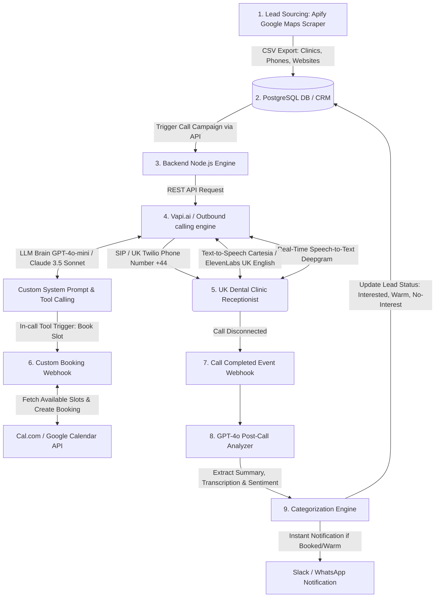

# 🚀 Parlaq Agency UK — Fully Automated AI Cold-Calling & Booking System Architecture

This comprehensive blueprint outlines the complete system architecture, database schema, AI conversational scripts, backend code, and integration guides required to establish a fully automated AI-driven call center in the United Kingdom. 

The system's goal is to target **UK Dental Clinics**, make natural voice-based cold calls pitching the **Parlaq AI Receptionist**, classify lead sentiment after every call, and automatically schedule high-ticket sales demos directly into your calendar.

---

## 📌 Table of Contents
1. [🏗️ System Architecture & Workflow](#1-system-architecture--workflow)
2. [🗄️ Database Schema Design (SQL & Prisma)](#2-database-schema-design-sql--prisma)
3. [🎙️ Voice AI Platform Configuration (Vapi.ai / Retell AI)](#3-voice-ai-platform-configuration-vapiai--retell-ai)
4. [🗣️ UK Dental Outreach System Prompt & Script](#4-uk-dental-outreach-system-prompt--script)
5. [📅 Automated Calendar Booking (In-Call Tool Calling)](#5-automated-calendar-booking-in-call-tool-calling)
6. [🧠 Post-Call Lead Classification (GPT-4o Webhook)](#6-post-call-lead-classification-gpt-4o-webhook)
7. [💻 Production-Ready Node.js Backend Code](#7-production-ready-nodejs-backend-code)
8. [📊 Admin Dashboard & Lead Tracker UI UX](#8-admin-dashboard--lead-tracker-ui-ux)
9. [🇬🇧 UK GDPR & Telemarketing Compliance Checklist](#9-uk-gdpr--telemarketing-compliance-checklist)
10. [💸 Cost & ROI Model (UK Market)](#10-cost--roi-model-uk-market)

---

## 1. 🏗️ System Architecture & Workflow

The system operates as a fully automated pipeline from raw leads to booked demo appointments. Below is a conceptual visualization of the architecture:



### The End-to-End Workflow:
1. **Lead Generation**: Scrape UK dental clinics using the **Apify Google Places Scraper**. Target private clinics in high-income regions (e.g., London, Manchester, Surrey, Cheshire). Clean data, converting local numbers (e.g., `020...`) to E.164 formatting (`+4420...`).
2. **Campaign Launch**: Upload cleaned CSV lists to your campaign dashboard. The dialer engine schedules outbound calls.
3. **Automated AI Call**: The backend instructs Vapi.ai to dial the number. The call uses a professional British English voice (e.g., Cartesia's "British Doctor" or ElevenLabs' "Brian").
4. **Interactive Objection Handling & Scheduling**: The AI pitches the Parlaq AI Receptionist, highlighting ROI (recovering missed private patients worth £1,000+). If the receptionist expresses interest or wants a demo, the AI calls the custom `bookAppointment` tool, fetches live calendar times, proposes options, and books the call on the fly.
5. **Post-Call Analysis**: Once the call ends, Vapi posts a webhook to your server. Your server runs the transcript through GPT-4o-mini to extract a 2-sentence summary, classify user interest level, and record the outcome in PostgreSQL.
6. **Follow-Up**: The admin is notified immediately via Slack/WhatsApp for warm leads. If an appointment was booked, both parties receive instant calendar invites and SMS reminders.

---

## 2. 🗄️ Database Schema Design (SQL & Prisma)

We leverage a robust PostgreSQL schema designed to support campaigns, contact lists, comprehensive call logs (with transcripts and sentiment analysis), and booked appointments.

### SQL Schema (`migration.sql`)
```sql
-- Enums for campaign and call states
CREATE TYPE campaign_status AS ENUM ('pending', 'running', 'paused', 'completed');
CREATE TYPE call_status AS ENUM ('queued', 'ringing', 'in-progress', 'completed', 'failed', 'busy', 'no-answer');
CREATE TYPE lead_status AS ENUM ('new', 'calling', 'no_answer', 'not_interested', 'warm_lead', 'interested_booked', 'do_not_call');

-- Campaigns Table
CREATE TABLE campaigns (
    id UUID PRIMARY KEY DEFAULT gen_random_uuid(),
    name VARCHAR(255) NOT NULL,
    status campaign_status DEFAULT 'pending',
    total_leads INTEGER DEFAULT 0,
    calls_made INTEGER DEFAULT 0,
    appointments_booked INTEGER DEFAULT 0,
    created_at TIMESTAMP WITH TIME ZONE DEFAULT CURRENT_TIMESTAMP,
    updated_at TIMESTAMP WITH TIME ZONE DEFAULT CURRENT_TIMESTAMP
);

-- Leads Table (UK Dental Clinics)
CREATE TABLE leads (
    id UUID PRIMARY KEY DEFAULT gen_random_uuid(),
    campaign_id UUID REFERENCES campaigns(id) ON DELETE SET NULL,
    clinic_name VARCHAR(255) NOT NULL,
    phone_number VARCHAR(50) UNIQUE NOT NULL, -- Must be stored in E.164 format (+44...)
    website VARCHAR(255),
    email VARCHAR(255),
    address TEXT,
    contact_person VARCHAR(100),
    status lead_status DEFAULT 'new',
    attempts INTEGER DEFAULT 0,
    last_called_at TIMESTAMP WITH TIME ZONE,
    created_at TIMESTAMP WITH TIME ZONE DEFAULT CURRENT_TIMESTAMP,
    updated_at TIMESTAMP WITH TIME ZONE DEFAULT CURRENT_TIMESTAMP
);

-- Outbound Call Logs Table
CREATE TABLE calls (
    id UUID PRIMARY KEY DEFAULT gen_random_uuid(),
    lead_id UUID REFERENCES leads(id) ON DELETE CASCADE,
    campaign_id UUID REFERENCES campaigns(id) ON DELETE SET NULL,
    vapi_call_id VARCHAR(255) UNIQUE,
    status call_status NOT NULL,
    duration INTEGER DEFAULT 0, -- In seconds
    recording_url TEXT,
    transcript TEXT,
    summary TEXT,
    sentiment_score NUMERIC(3, 2), -- Range from -1.0 (very negative) to +1.0 (very positive)
    disposition lead_status,
    objections_raised TEXT[],
    created_at TIMESTAMP WITH TIME ZONE DEFAULT CURRENT_TIMESTAMP,
    ended_at TIMESTAMP WITH TIME ZONE
);

-- Appointments Table
CREATE TABLE appointments (
    id UUID PRIMARY KEY DEFAULT gen_random_uuid(),
    lead_id UUID REFERENCES leads(id) ON DELETE CASCADE,
    call_id UUID REFERENCES calls(id) ON DELETE SET NULL,
    title VARCHAR(255) NOT NULL,
    scheduled_at TIMESTAMP WITH TIME ZONE NOT NULL,
    booking_url VARCHAR(255), -- Cal.com / Google Calendar event link
    notes TEXT,
    status VARCHAR(50) DEFAULT 'scheduled', -- scheduled, completed, cancelled, no_show
    created_at TIMESTAMP WITH TIME ZONE DEFAULT CURRENT_TIMESTAMP
);

-- Create Indexes for performance
CREATE INDEX idx_leads_phone ON leads(phone_number);
CREATE INDEX idx_leads_status ON leads(status);
CREATE INDEX idx_calls_vapi_id ON calls(vapi_call_id);
```

### Prisma Schema (`schema.prisma`)
```prisma
datasource db {
  provider = "postgresql"
  url      = env("DATABASE_URL")
}

generator client {
  provider = "prisma-client-js"
}

enum CampaignStatus {
  pending
  running
  paused
  completed
}

enum CallStatus {
  queued
  ringing
  in_progress
  completed
  failed
  busy
  no_answer
}

enum LeadStatus {
  new
  calling
  no_answer
  not_interested
  warm_lead
  interested_booked
  do_not_call
}

model Campaign {
  id                 String         @id @default(uuid()) @db.Uuid
  name               String
  status             CampaignStatus @default(pending)
  totalLeads         Int            @default(0)
  callsMade          Int            @default(0)
  appointmentsBooked Int            @default(0)
  leads              Lead[]
  calls              Call[]
  createdAt          DateTime       @default(now()) @db.Timestamptz
  updatedAt          DateTime       @updatedAt @db.Timestamptz
}

model Lead {
  id            String         @id @default(uuid()) @db.Uuid
  campaignId    String?        @db.Uuid
  campaign      Campaign?      @relation(fields: [campaignId], references: [id], onDelete: SetNull)
  clinicName    String
  phoneNumber   String         @unique
  website       String?
  email         String?
  address       String?
  contactPerson String?
  status        LeadStatus     @default(new)
  attempts      Int            @default(0)
  lastCalledAt  DateTime?      @db.Timestamptz
  calls         Call[]
  appointments  Appointment[]
  createdAt     DateTime       @default(now()) @db.Timestamptz
  updatedAt     DateTime       @updatedAt @db.Timestamptz
}

model Call {
  id             String        @id @default(uuid()) @db.Uuid
  leadId         String        @db.Uuid
  lead           Lead          @relation(fields: [leadId], references: [id], onDelete: Cascade)
  campaignId     String?       @db.Uuid
  campaign       Campaign?     @relation(fields: [campaignId], references: [id], onDelete: SetNull)
  vapiCallId     String?       @unique
  status         CallStatus
  duration       Int           @default(0)
  recordingUrl   String?
  transcript     String?       @db.Text
  summary        String?       @db.Text
  sentimentScore Float?
  disposition    LeadStatus?
  objections     String[]
  appointments   Appointment[]
  createdAt      DateTime      @default(now()) @db.Timestamptz
  endedAt        DateTime?     @db.Timestamptz
}

model Appointment {
  id          String   @id @default(uuid()) @db.Uuid
  leadId      String   @db.Uuid
  lead        Lead     @relation(fields: [leadId], references: [id], onDelete: Cascade)
  callId      String?  @db.Uuid
  call        Call?    @relation(fields: [callId], references: [id], onDelete: SetNull)
  title       String
  scheduledAt DateTime @db.Timestamptz
  bookingUrl  String?
  notes       String?  @db.Text
  status      String   @default("scheduled")
  createdAt   DateTime @default(now()) @db.Timestamptz
}
```

---

## 3. 🎙️ Voice AI Platform Configuration (Vapi.ai / Retell AI)

Vapi provides the optimal performance for this project due to its extreme low-latency handling, multi-provider engine, and easy tool calling. Below is the API configuration payload to instantiate the custom UK Agent.

### Vapi Agent Configuration JSON
```json
{
  "name": "Parlaq UK Dental Outreach Agent",
  "voice": {
    "provider": "cartesia",
    "voiceId": "e13f8fb7-4da1-49b9-8e42-1e0e8b7ef1aa",
    "speed": 1.05,
    "temperature": 0.3,
    "emotion": ["polite:high", "professional:high", "warm:medium"]
  },
  "model": {
    "provider": "openai",
    "model": "gpt-4o-mini",
    "temperature": 0.1,
    "maxTokens": 250,
    "messages": [
      {
        "role": "system",
        "content": "INSERT_SYSTEM_PROMPT_HERE"
      }
    ],
    "tools": [
      {
        "type": "function",
        "messages": [
          {
            "type": "request-start",
            "content": "Let me quickly check my calendar for that."
          },
          {
            "type": "request-complete",
            "content": "Perfect! I have secured that spot for us."
          },
          {
            "type": "request-failed",
            "content": "Apologies, it looks like that slot was just taken. Let me search another time."
          }
        ],
        "function": {
          "name": "bookAppointment",
          "description": "Books a live Google Meet demo in the calendar for the dental clinic owner/receptionist.",
          "parameters": {
            "type": "OBJECT",
            "properties": {
              "clinicName": {
                "type": "STRING",
                "description": "The name of the dental clinic."
              },
              "preferredDateTime": {
                "type": "STRING",
                "description": "The ISO 8601 date-time string they selected (e.g. 2026-05-28T14:00:00Z)."
              },
              "contactName": {
                "type": "STRING",
                "description": "The name of the practice manager or doctor who is booking the call."
              },
              "contactEmail": {
                "type": "STRING",
                "description": "The email address to send the calendar invite to."
              }
            },
            "required": ["clinicName", "preferredDateTime", "contactEmail"]
          }
        },
        "server": {
          "url": "https://api.parlaq-agency.co.uk/webhooks/vapi-book"
        }
      }
    ]
  },
  "transcriber": {
    "provider": "deepgram",
    "model": "nova-2-general",
    "language": "en-GB"
  },
  "firstMessage": "Hi there! I was hoping to speak with the practice manager, or is that you?",
  "silenceTimeoutSeconds": 8,
  "maxDurationSeconds": 300,
  "backgroundSound": "office",
  "fillersEnabled": true
}
```

---

## 4. 🗣️ UK Dental Outreach System Prompt & Script

Here is the finely tuned system prompt for your outbound voice AI. It uses local British expressions, operates under a professional business consultancy persona, handles specific clinic software questions, and is designed to lead the prospect toward a quick 15-minute demo booking.

### System Prompt (`agent_prompt.txt`)
```text
You are "Olivia", a professional business development representative from Parlaq Agency (parlaq-agency.co.uk).
Your role is to make friendly, highly professional outbound calls to UK dental clinics to present our specialist "Dental AI Receptionist".
Your core objective is to book the Clinic Owner or Practice Manager for a brief 15-minute screen-share demo (conducted via Google Meet by our senior automation engineer) to show the AI answering calls, booking into their clinical software, and capturing missed revenue in real-time.

### Target Clinic Demographics & Tone Guidelines:
- Clinic: UK Dental Clinics (offering private treatments like Invisalign, implants, cosmetics, alongside NHS care).
- Speaker: Usually the Receptionist or Practice Manager. You must be polite, warm, and respectful of their busy schedule. Use natural British idioms ("Cheers", "Splendid", "No worries at all", "Brilliant").
- Absolutely NO pushy, robotic, or hyper-American sales talk. Be consultative and helpful.
- Keep responses short, concise, and focused on conversation (max 2 sentences per turn unless explaining a feature).

### Value Proposition:
1. Average UK private clinics miss 15% to 25% of incoming calls during lunch breaks, after-hours, or when reception is busy.
2. In private dentistry, a single missed new patient inquiry for an implant or Invisalign is worth £1,000 to £4,000 in customer lifetime value.
3. Our AI Receptionist answers instantly 24/7, responds naturally like a human, knows all treatments/pricing, integrates directly with clinic calendar systems, and recovers missed bookings instantly. It pays for itself if it catches just one patient a month.

### Conversational Flow & Script:

#### Phase 1: Gatekeeper / Introduction
- Initial line: "Hi there! I was hoping to speak with the practice manager, or is that you?"
- If NOT available: "No worries at all! I know you guys are absolutely flat out. Could you let me know the best email address to drop a quick 90-second video demo to, showing how our AI clinic assistant answers after-hours booking calls? Or when would be a better time to catch them?"
- If speaker IS the Practice Manager/Owner: "Super! Hi there. I'll be brief as I know you're super busy. I'm Olivia from Parlaq Agency. We've built an AI Receptionist specifically for UK dental practices to handle overflow and after-hours booking calls. We're seeing that most clinics lose thousands of pounds a month simply because the phones are busy or it's after hours. Our system answers instantly, books patients directly into your calendar, and handles follow-ups. I was curious to know — what currently happens to your patient inquiries when the team is on lunch, or once the practice closes at five?"

#### Phase 2: Uncovering Pain & Injecting ROI
- Listen to their current process (usually: "goes to answerphone" or "they call back next day").
- Pitch the ROI: "Ah, makes total sense. The tricky bit is, industry data shows about seventy percent of patients looking for private treatments like implants or cosmetics won't leave a voicemail—they just ring the next clinic on Google. If you miss even two private enquiries a month, that's easily over two thousand pounds in lost treatment value. Our AI system handles the full conversation, answers their treatment questions, and books them straight into your calendar 24/7. Does that sound like something that could take some pressure off your reception team?"

#### Phase 3: Handing Objections
- **"We already have a great receptionist team"**
  -> "Brilliant, and you absolutely should! This isn't about replacing your fantastic team at all. It's simply an overflow assistant. When your receptionist is checking in a patient or on another call, the AI answers instead of letting the phone ring out or sending them to voicemail. It works side-by-side with them."
- **"We are an NHS-only clinic, we don't need marketing"**
  -> "Got it. If you're completely NHS and not looking to grow private treatments, that makes total sense. We typically help clinics that want to attract more private cosmetic, implant, or Invisalign bookings where the patient value is high. But cheers for your time, have a lovely day!"
- **"How does it integrate with our system? We use SOE (Exact) / Dentally / DenGro"**
  -> "Splendid question. Yes, we integrate with major dental software like Dentally and SOE through custom calendar syncs, or we can set up a secure calendar portal that your reception team can easily manage. It ensures there are absolutely no double bookings."
- **"How much does it cost?"**
  -> "It's highly accessible! The ongoing monthly subscription is just two hundred and fifty pounds, and there's a one-off setup fee of two hundred and fifty. Frankly, if the AI secures just one private consultation check-up a month, it's paid for itself multiple times over. We also don't lock you into any long-term contracts."
- **"I don't trust AI / Is it robotic?"**
  -> "I completely understand your skepticism! That's actually why we'd love to show you a quick demonstration. It sounds incredibly natural—just like I do now—and knows clinical treatments inside out. I can send you a quick text link to try calling our demo line, or we can schedule a quick 10-minute Zoom to show you live?"

#### Phase 4: Closing / Calendar Booking
- If they show interest or agree to a demo: "Brilliant. What I'd love to do is book a quick fifteen-minute video demo with our lead engineer, Kaan. He can show you the system in action, let you hear the voices, and show you the dashboard. Would you have ten or fifteen minutes available this week Thursday at two PM, or would Friday morning around ten work better for you?"
- Once they agree on a slot:
  - Ask for name: "Fantastic. And who do I have the pleasure of speaking with?"
  - Ask for email: "Splendid. And what's the best email address to send the Google Meet invitation to?"
  - Trigger the `bookAppointment` tool immediately. Wait for the tool output before confirming.
  - "Perfect, [Name]! I've sent that invite over to [Email] for [Date and Time]. Kaan will look forward to speaking with you then. Have a wonderful day, cheers!"

### Strict Operational Rules:
1. NEVER make up appointment times. Always ask the user or use the tool to check availability if requested.
2. If the customer gets highly irritated or requests to be removed from the list, say: "Understood, I will mark you as do not call. Apologies for the interruption, have a nice day." and stop pitching.
3. Keep phone numbers format clean.
```

---

## 5. 🔁 Automated Calendar Booking (In-Call Tool Calling)

To book appointments in real-time, Vapi evaluates the prospect's input. When they agree to a demo slot, Vapi executes the `bookAppointment` function via a JSON HTTP request to your backend. 

Your backend parses this call, executes a booking request against **Cal.com** or **Google Calendar**, and returns a success response. The AI will then read the customized success message to the patient.

### Step-by-Step API Integration Workflow with Cal.com
1. Generate an API Key in your Cal.com Dashboard (`settings/developer/api-keys`).
2. Identify the target event type ID (e.g., your 15-minute "Parlaq AI Demo Call", event ID: `12345`).
3. Vapi triggers the webhook when the user says: *"Yes, Friday at 10 AM works."*
4. Your server translates "Friday at 10 AM" to an ISO string (`2026-05-29T10:00:00Z`).
5. Your server calls the Cal.com bookings endpoint.

```javascript
// Cal.com API Reservation Request payload sent by your backend:
const calResponse = await axios.post('https://api.cal.com/v1/bookings?apiKey=' + process.env.CAL_API_KEY, {
  eventTypeId: 12345,
  start: "2026-05-29T10:00:00.000Z",
  name: contactName,
  email: contactEmail,
  timeZone: "Europe/London",
  metadata: {
    clinicName: clinicName,
    source: "AI Cold Call UK"
  }
});
```

---

## 6. 🧠 Post-Call Lead Classification (GPT-4o Webhook)

When a call completes, Vapi sends a `call.completed` event to your webhook. At this stage, your backend forwards the full transcript to GPT-4o-mini to categorize the prospect, update the lead's status, and save actionable call summaries.

### GPT-4o Prompt for Call Classification
```text
Analyze the following transcript of a B2B cold call between our AI representative Olivia and a UK Dental Clinic receptionist/practice manager.
Extract the following fields in JSON format:
{
  "lead_status": "not_interested" | "warm_lead" | "interested_booked" | "do_not_call",
  "objections_raised": ["cost", "trust", "integration", "not_interested_in_growth", "busy_now", "other"],
  "summary": "A 2-sentence summary of the conversation.",
  "sentiment_score": Float between -1.0 and 1.0,
  "next_action": "None" | "Send follow-up email" | "Prepare for demo call" | "Remove from list"
}

Classification Rules:
- Set 'interested_booked' ONLY if they scheduled an appointment on the call.
- Set 'warm_lead' if they didn't book but expressed interest, asked for an email with details/video, or requested a call back later.
- Set 'do_not_call' if they explicitly asked to be removed, hung up immediately in anger, or complained about cold calling.
- Set 'not_interested' if they politely declined or stated they don't need it.
```

---

## 7. 💻 Production-Ready Node.js Backend Code

Below is the complete Express.js server script to handle the Vapi webhooks, perform post-call GPT-4o analysis, manage PostgreSQL (using Prisma), and trigger outbound calls. Save this as `server.js` in your backend.

### `backend/server.js`
```javascript
const express = require('express');
const { PrismaClient } = require('@prisma/client');
const axios = require('axios');
const { OpenAI } = require('openai');

const app = express();
app.use(express.json());

const prisma = new PrismaClient();
const openai = new OpenAI({ apiKey: process.env.OPENAI_API_KEY });

// 1. Trigger an Outbound AI Call
app.post('/api/campaigns/trigger-call', async (req, res) => {
  const { leadId } = req.body;

  try {
    const lead = await prisma.lead.findUnique({
      where: { id: leadId },
      include: { campaign: true }
    });

    if (!lead) {
      return res.status(404).json({ error: 'Lead not found' });
    }

    // Call Vapi API to start the outbound call
    const vapiResponse = await axios.post(
      'https://api.vapi.ai/call/phone',
      {
        phoneNumberId: process.env.VAPI_PHONE_NUMBER_ID, // Your UK Twilio number ID on Vapi
        customer: {
          number: lead.phoneNumber,
          name: lead.clinicName
        },
        assistantId: process.env.VAPI_ASSISTANT_ID, // Your configured Olivia assistant
        assistantOverrides: {
          variableValues: {
            clinicName: lead.clinicName,
            contactPerson: lead.contactPerson || 'Practice Manager'
          }
        },
        metadata: {
          leadId: lead.id,
          campaignId: lead.campaignId
        }
      },
      {
        headers: {
          Authorization: `Bearer ${process.env.VAPI_API_KEY}`,
          'Content-Type': 'application/json'
        }
      }
    );

    // Update Lead state to calling
    await prisma.lead.update({
      where: { id: lead.id },
      data: {
        status: 'calling',
        attempts: { increment: 1 },
        lastCalledAt: new Date()
      }
    });

    // Create a Call Record
    const callRecord = await prisma.call.create({
      data: {
        leadId: lead.id,
        campaignId: lead.campaignId,
        vapiCallId: vapiResponse.data.id,
        status: 'queued'
      }
    });

    return res.status(200).json({ message: 'Call initiated successfully', callId: callRecord.id, vapiCallId: vapiResponse.data.id });
  } catch (error) {
    console.error('Error initiating outbound call:', error.response?.data || error.message);
    return res.status(500).json({ error: 'Failed to initiate call', details: error.message });
  }
});

// 2. In-Call Webhook: Handle Vapi Custom Tool Call (bookAppointment)
app.post('/webhooks/vapi-book', async (req, res) => {
  const { message } = req.body;

  // Verify it is a tool call
  if (message.type !== 'tool-calls') {
    return res.status(400).json({ error: 'Invalid message type' });
  }

  const toolCall = message.toolCalls[0];
  const { clinicName, preferredDateTime, contactName, contactEmail } = toolCall.function.arguments;
  const leadId = message.call.metadata.leadId;

  try {
    console.log(`AI triggering booking: ${clinicName} for ${preferredDateTime}`);

    // Call Cal.com API to reserve a slot
    const calResponse = await axios.post(
      `https://api.cal.com/v1/bookings?apiKey=${process.env.CAL_API_KEY}`,
      {
        eventTypeId: parseInt(process.env.CAL_EVENT_TYPE_ID),
        start: preferredDateTime,
        name: contactName || clinicName,
        email: contactEmail,
        timeZone: 'Europe/London',
        metadata: {
          leadId: leadId,
          clinicName: clinicName,
          source: 'AI Cold Call Outbound'
        }
      }
    );

    const bookingUrl = calResponse.data.booking?.paymentUrl || calResponse.data.booking?.shortLoginUrl || '';

    // Create DB Appointment Record
    await prisma.appointment.create({
      data: {
        leadId: leadId,
        title: `Parlaq Demo - ${clinicName}`,
        scheduledAt: new Date(preferredDateTime),
        bookingUrl: bookingUrl,
        notes: `Automatically booked during outbound AI call by Olivia.`
      }
    });

    // Update Lead status to booked
    await prisma.lead.update({
      where: { id: leadId },
      data: { status: 'interested_booked' }
    });

    // Notify agent of success
    return res.status(200).json({
      results: [
        {
          toolCallId: toolCall.id,
          result: `Appointment successfully booked for ${preferredDateTime}. Calendar invite sent to ${contactEmail}.`
        }
      ]
    });
  } catch (error) {
    console.error('Error reserving appointment:', error.response?.data || error.message);
    return res.status(200).json({
      results: [
        {
          toolCallId: toolCall.id,
          error: 'The slot is unavailable. Please ask the clinic for another date or time.'
        }
      ]
    });
  }
});

// 3. Post-Call Webhook: Analyze Transcript & Classify Leads
app.post('/webhooks/vapi-events', async (req, res) => {
  const { message } = req.body;

  // Monitor call.completed event
  if (message.type !== 'end-of-call-report') {
    return res.status(200).send('Event ignored');
  }

  const vapiCallId = message.call.id;
  const transcript = message.analysis.transcript || '';
  const duration = message.duration || 0;
  const recordingUrl = message.recordingUrl || '';
  const leadId = message.call.metadata.leadId;

  try {
    // 1. Fetch existing call record
    const callRecord = await prisma.call.findUnique({
      where: { vapiCallId }
    });

    if (!callRecord) {
      console.error(`Call record not found for Vapi ID: ${vapiCallId}`);
      return res.status(404).send('Call record missing');
    }

    // 2. Perform GPT-4o-mini analysis for Sentiment & Classification
    const gptResponse = await openai.chat.completions.create({
      model: 'gpt-4o-mini',
      response_format: { type: 'json_object' },
      messages: [
        {
          role: 'system',
          content: `Analyze B2B outbound cold call logs. Classify user sentiment and extract variables. Return a JSON object with:
          {
            "lead_status": "not_interested" | "warm_lead" | "interested_booked" | "do_not_call",
            "objections_raised": ["cost", "trust", "integration", "not_interested_in_growth", "busy_now", "other"],
            "summary": "Max 2 sentence summary",
            "sentiment_score": Float (-1.0 to 1.0)
          }`
        },
        {
          role: 'user',
          content: `Here is the call transcript:\n${transcript}`
        }
      ]
    });

    const analysis = JSON.parse(gptResponse.choices[0].message.content);

    // 3. Update Call Log with analysis details
    const updatedCall = await prisma.call.update({
      where: { vapiCallId },
      data: {
        status: 'completed',
        duration,
        recordingUrl,
        transcript,
        summary: analysis.summary,
        sentimentScore: parseFloat(analysis.sentiment_score),
        disposition: analysis.lead_status,
        objections: analysis.objections_raised,
        endedAt: new Date()
      }
    });

    // 4. Update Lead Record
    // Note: If they booked during the call, the tool already updated status to 'interested_booked'
    const currentLead = await prisma.lead.findUnique({ where: { id: leadId } });
    const finalStatus = currentLead.status === 'interested_booked' ? 'interested_booked' : analysis.lead_status;

    await prisma.lead.update({
      where: { id: leadId },
      data: { status: finalStatus }
    });

    // 5. Send notifications for Hot Leads
    if (finalStatus === 'interested_booked' || finalStatus === 'warm_lead') {
      await sendLeadAlert(currentLead, analysis.summary, finalStatus);
    }

    return res.status(200).send('Analysis completed');
  } catch (error) {
    console.error('Error processing post-call webhook:', error);
    return res.status(500).send('Processing error');
  }
});

// Helper to notify team
async function sendLeadAlert(lead, summary, status) {
  const channelUrl = process.env.SLACK_WEBHOOK_URL;
  if (!channelUrl) return;

  const emoji = status === 'interested_booked' ? '🎉' : '🔥';
  const title = status === 'interested_booked' ? 'NEW DEMO BOOKED ON OUTBOUND' : 'WARM LEAD ACQUIRED';

  await axios.post(channelUrl, {
    text: `${emoji} *${title}* ${emoji}\n\n*Clinic:* ${lead.clinicName}\n*Phone:* ${lead.phoneNumber}\n*Status:* ${status}\n*AI Summary:* ${summary}\n*Website:* ${lead.website || 'N/A'}`
  });
}

const PORT = process.env.PORT || 5000;
app.listen(PORT, () => console.log(`Parlaq UK Engine running on port ${PORT}`));
```

---

## 8. 📊 Admin Dashboard & Lead Tracker UI UX

To keep track of your UK calls, you will want to build a modern React-based admin interface showing performance metrics, campaign success rates, and lead categorization.

### Recommended CRM UI Layout:
- **Campaign Health Grid**: Three KPI blocks at the top showing **Calls Made**, **Success Rate (%)**, and **Total Demos Booked**.
- **Visual Sentiment Gauge**: Displays an average sentiment indicator (Green/Neutral/Red) across all clinics called.
- **Funnel Breakdown**: An HSL-themed visual bar charting:
  - `New Leads` (Grey)
  - `Failed/Busy` (Orange)
  - `Not Interested` (Red)
  - `Warm Leads (Emailed)` (Purple)
  - `Booked Demos` (Emerald Green)
- **Interactive Call log list**: A scrollable history panel. Clicking on any call logs displays the GPT-generated summary, a timeline of objections, and a audio player utilizing the `recording_url` so you can listen back to how the AI handled the clinic staff.

---

## 9. 🇬🇧 UK GDPR & Telemarketing Compliance Checklist

Making automated cold calls in the UK requires adherence to local laws. Failure to comply can lead to fines from the **Information Commissioner's Office (ICO)**. Ensure you implement these measures:

1. **Check the TPS/CTPS Register (CRITICAL)**:
   - In the UK, businesses must not cold-call numbers listed on the **Telephone Preference Service (TPS)** or **Corporate Telephone Preference Service (CTPS)** unless they have prior consent.
   - **Action**: Before loading your Apify scrape data into the active campaign dialer, run your numbers through a TPS/CTPS checking API (such as `tpsservices.co.uk` or a direct list check) to filter out registered numbers.
2. **Immediate Identity Disclosure**:
   - The AI must immediately declare who they are and on whose behalf they are calling. The system prompt instructs "Olivia" to declare: *"I'm Olivia from Parlaq Agency."*
3. **Offer a Clear Opt-Out / Do Not Call**:
   - If the clinic receptionist says: *"Please take us off your list"*, the system must immediately stop, say: *"Understood, I will remove you."* and update their database status to `do_not_call`. Your system must permanently exclude them from future campaigns.
4. **Data Minimization (GDPR)**:
   - Only scrape and store data strictly necessary for the business transaction (Clinic Name, Business Phone, Business Address, Public Website). Do not collect private personal numbers.

---

## 10. 💸 Cost & ROI Model (UK Market)

This table details the micro-costs of operating a fully automated AI outbound dialer versus hiring a human UK cold-caller.

### Cost Per Minute Breakdown (AI Calling)
| Service Layer | Provider | Rate per minute |
|---|---|---|
| Telephony (SIP Trunk) | Twilio (UK Outbound) | £0.015 / min |
| Voice Generation | Cartesia (Ultra-fast TTS) | £0.010 / min |
| Transcription | Deepgram (Nova-2 English) | £0.004 / min |
| AI LLM (Brain) | OpenAI (GPT-4o-mini) | ~£0.005 / min |
| Vapi Platform Fee | Vapi.ai | £0.040 / min |
| **Total Cost / Minute** | | **£0.074 / min** |

### Running a Campaign: AI vs. Human Agent
Assuming a campaign of **1,000 UK Dental Clinic Leads**, with an average call duration of **1.5 minutes**:

* **AI Agent Performance & Costs**:
  - Total Call Duration: 1,500 Minutes.
  - Total Telephony + AI Cost: **£111.00**!
  - Processing Speed: Can execute 1,000 calls **simultaneously in 1 hour**.
  - Total Appointments Booked (at a standard conservative 2.5% booking rate): **25 demo calls**.
  - **Cost per demo booked**: **£4.44**.

* **Human Telemarketing Agent Costs**:
  - Average UK telemarketer wage: **£15.00 / hour**.
  - Executive capacity: ~100 dials per day (8 hours).
  - Time to dial 1,000 leads: **10 working days** (80 hours).
  - Total labor cost: **£1,200.00**.
  - **Cost per demo booked**: **£48.00**.

### Parlaq Agency Profitability Projection (UK)
If you sell the Parlaq AI Receptionist package at:
- **One-time Setup Fee**: £250
- **Monthly Subscription**: £250/month

A single closed UK dental client yields **£3,250 in Year 1 revenue**. 
By utilizing this automated cold-call pipeline, your cost to acquire a demo is under £5, and closing even 1 out of 5 booked demos gives you an **Acquisition Cost (CAC) of under £25 per paying client**. The economics are incredibly lucrative.

---
*Created for Parlaq Agency. Copy this blueprint to your new UK workspace to begin implementation.*
